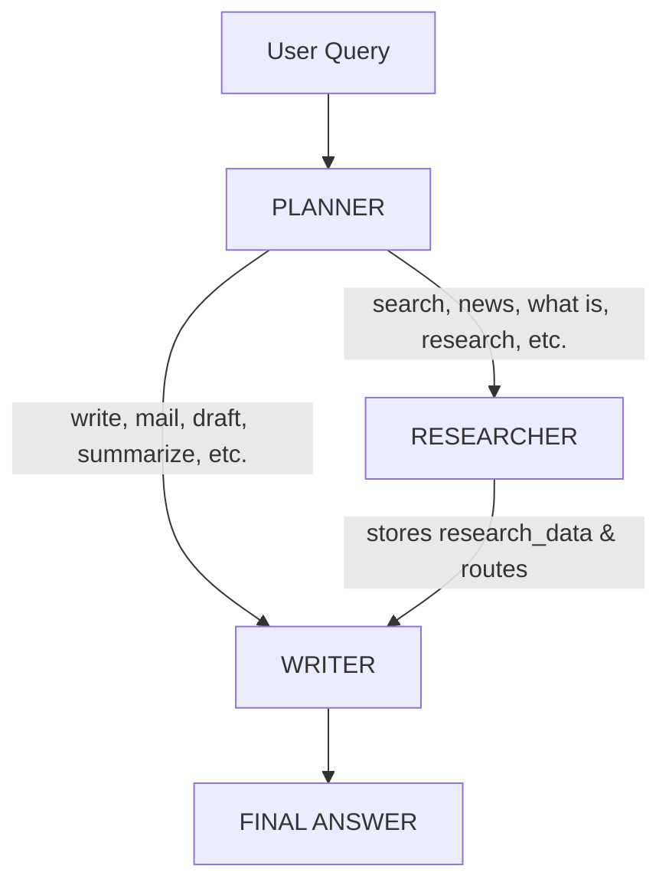

# Week 7: Multi-Agent System (Planner + Researcher + Writer)

A production-ready multi-agent AI system built with **LangGraph**, **Groq (LLaMA 3.3 70B)**, and **Tavily** web search. This system intelligently routes user queries to the appropriate agent — either a **Researcher** (for web search) or a **Writer** (for content generation/formatting).

---

## 📋 Table of Contents
- [Overview](#overview)
- [Architecture](#architecture)
- [Flow Diagram](#flow-diagram)
- [Tech Stack](#tech-stack)
- [Project Structure](#project-structure)
- [Setup & Installation](#setup--installation)
- [Configuration](#configuration)
- [How to Run](#how-to-run)
- [Example Queries](#example-queries)
- [Logging](#logging)
- [Deliverables Checklist](#deliverables-checklist)

---

##  Overview

This multi-agent system consists of three specialized agents:

| Agent | Role |
|-------|------|
| **Planner** | Analyzes the user query and decides which agent to call next based on keywords. |
| **Researcher** | Performs web searches using the Tavily API and stores the results. |
| **Writer** | Generates a well-structured, formatted final answer (using research data if available, otherwise directly from the query). |

**Key Features:**
-  Async LangGraph workflow
-  Semantic/keyword-based routing
-  Silent file-based logging (production-grade)
-  Robust error handling
-  Clean modular code structure

---

## 🏗 Architecture

```
┌─────────────┐
│  User Query │
└──────┬──────┘
       ▼
┌─────────────┐
│   PLANNER   │ ◄─── Decision logic
└──────┬──────┘
       │
       ├───────────────────────────────┐
       │ (Writer keywords)              │ (Researcher keywords)
       ▼                               ▼
┌─────────────┐                 ┌─────────────┐
│   WRITER    │                 │ RESEARCHER  │
└─────────────┘                 └──────┬──────┘
       │                               │
       │                               ▼
       │                       (Auto-route to Writer)
       │                               │
       ▼                               ▼
┌─────────────────────────────────────────────────┐
│                  FINAL ANSWER                    │
└─────────────────────────────────────────────────┘
```

---

## 🔄 Flow Diagram



---

## 🧰 Tech Stack

| Layer | Tool | Purpose |
|-------|------|---------|
| LLM | Groq (LLaMA 3.3 70B) | Fast inference, free tier |
| Orchestration | LangGraph | State machine + conditional routing |
| Web Search | Tavily | Real-time search API |
| Environment | python-dotenv | Secure key management |
| Logging | Python `logging` | Production-grade file-based logging |
| Async | `asyncio` | Non-blocking agent execution |

---

## 📁 Project Structure

```
Week7_MultiAgent/
├── .env                      # API keys (ignore in git)
├── .gitignore                # Ignore venv, logs, .env
├── requirements.txt          # Python dependencies
├── README.md                 # This file
├── logger.py                 # Logging setup (file only, no console)
├── state.py                  # AgentState TypedDict
├── tools.py                  # Tavily web search wrapper
├── graph.py                  # LangGraph workflow builder
├── main.py                   # Entry point
├── agents/
│   ├── __init__.py           # Package marker
│   ├── planner.py            # Planner node logic
│   ├── researcher.py         # Researcher node logic
│   └── writer.py             # Writer node logic
└── logs/                     # Auto-generated log files
    └── agent_YYYYMMDD_HHMMSS.log
```

---

## ⚙️ Setup & Installation

### 1. Clone or create project folder
```bash
mkdir Week7_MultiAgent
cd Week7_MultiAgent
```

### 2. Create virtual environment
```bash
python -m venv venv
source venv/bin/activate      # Linux/Mac
# OR
venv\Scripts\activate         # Windows
```

### 3. Install dependencies
```bash
pip install -r requirements.txt
```

### 4. Create `.env` file
```
GROQ_API_KEY=your_groq_api_key_here
TAVILY_API_KEY=your_tavily_api_key_here
```

---

## 🔑 Configuration

| Environment Variable | Description |
|----------------------|-------------|
| `GROQ_API_KEY` | Your Groq API key (get from console.groq.com) |
| `TAVILY_API_KEY` | Your Tavily API key (get from app.tavily.com) |

---

## 🚀 How to Run

```bash
python main.py
```

Type your query and press Enter. The system will:
1. Route it via Planner
2. Call Researcher (if needed) or directly Writer
3. Generate the final answer
4. Print the result on the terminal
5. Silently save the entire conversation log in `logs/`

---


## 📜 Logging

Logs are saved **automatically** in the `logs/` folder with a timestamp.

- **Format:** `agent_YYYYMMDD_HHMMSS.log`
- **Content:** Full decision history, agent calls, errors, and final output
- **Terminal:** No logger prints appear on terminal — only your app prints are visible


---

## 🤝 Connect

**Intern:** Adina Rehman
**Program:** QM Logics AI Internship
**Week:** 7 – Multi-Agent Systems

---

## 📄 License

This project is developed as part of the QM Logics internship program.
