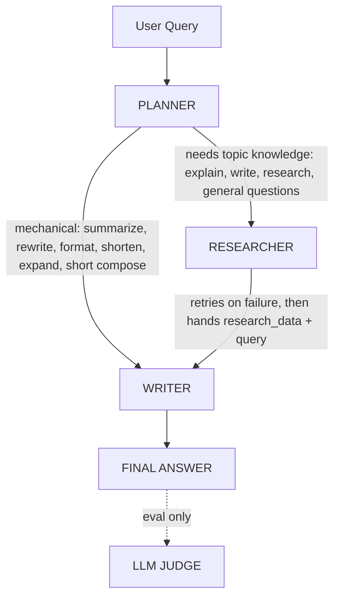

#  Multi-Agent System with Evaluation & Observability (Week 7 + 8)

A production-style multi-agent AI system built with **LangGraph**, **Groq (LLaMA 3.3 70B)**, and **Tavily** web search — extended with an **LLM-as-Judge evaluation suite**, **hallucination guardrails**, **retry logic**, and full **LangSmith tracing**.

The system routes each user query to the right agent: a **Researcher** (for anything requiring real topic knowledge) or a **Writer** (for purely mechanical tasks on text the user already provided).

---

## 📋 Table of Contents
- [Overview](#overview)
- [Architecture](#architecture)
- [Flow Diagram](#flow-diagram)
- [Tech Stack](#tech-stack)
- [Project Structure](#project-structure)
- [Setup & Installation](#setup--installation)
- [Configuration](#configuration)
- [How to Run](#how-to-run)
- [Week 7 — Multi-Agent System](#week-7--multi-agent-system)
- [Week 8 — Evaluation, Guardrails & Observability](#week-8--evaluation-guardrails--observability)
- [Bugs Found & Fixed](#bugs-found--fixed)
- [Deliverables Checklist](#deliverables-checklist)

---

## 📌 Overview

Three specialized agents work together to answer any user query:

| Agent | Role |
|-------|------|
| **Planner** | Decides the task type and which agent should run next — Writer (mechanical, no topic knowledge needed) or Researcher (needs real information). |
| **Researcher** | Performs live web search via Tavily, with automatic retry on transient failures. |
| **Writer** | Generates the final answer — either directly, or grounded in the Researcher's data when research was used. |

**Key Features:**
- ✅ Async LangGraph workflow with hard-enforced routing rules
- ✅ LLM-based planning with a code-level whitelist safety net (not just prompt trust)
- ✅ Anti-hallucination guardrails in the Writer's system prompt
- ✅ Retry logic with exponential backoff on the web search tool
- ✅ 10-case evaluation suite with automated assertions
- ✅ LLM-as-Judge scoring (Hallucination / Relevance / Task Adherence) on every run
- ✅ Full LangSmith tracing + Feedback scores, chartable in Insights/Dashboard
- ✅ Clean, consistent terminal logging across all agents

---

## 🏗 Architecture

```
┌─────────────┐
│  User Query │
└──────┬──────┘
       ▼
┌─────────────┐
│   PLANNER   │ ◄─── LLM decides TASK + NEXT_AGENT
└──────┬──────┘      (code enforces a mechanical-task whitelist,
       │              overriding the LLM if it contradicts it)
       ├───────────────────────────────┐
       │ (mechanical task)             │ (needs topic knowledge)
       ▼                               ▼
┌─────────────┐                 ┌─────────────┐
│   WRITER    │                 │ RESEARCHER  │
└─────────────┘                 └──────┬──────┘
       │                               │ (retries on failure,
       │                               │  then hands data to Writer)
       │                               ▼
       │                       ┌─────────────┐
       │                       │   WRITER    │
       │                       └──────┬──────┘
       ▼                               ▼
┌─────────────────────────────────────────────────┐
│                  FINAL ANSWER                    │
└─────────────────────────────────────────────────┘
                       │
                       ▼
              ┌─────────────────┐
              │  LLM JUDGE (eval only)  │  → Hallucination / Relevance /
              └─────────────────┘         Task Adherence scores
```

**Routing rule (Week 8 fix):** Writer only runs directly for purely mechanical tasks — `summarize`, `rewrite`, `paraphrase`, `format`, `shorten`, `expand`, or a short generic `compose` (like a basic email) — where the user already supplied the content and no topic expertise is needed. Everything else (`explain`, `write` about a topic, `research`, general questions) is routed to the Researcher first, because the Writer has no reliable topic knowledge on its own. This is enforced in code, not just prompted — if the LLM's routing decision contradicts the whitelist, the code overrides it.

---

## 🔄 Flow Diagram



---

## 🧰 Tech Stack

| Layer | Tool | Purpose |
|-------|------|---------|
| LLM | Groq (LLaMA 3.3 70B Versatile) | Planning, writing, and judging |
| Orchestration | LangGraph | Async state machine + conditional routing |
| Web Search | Tavily | Real-time search, wrapped with retry logic |
| Observability | LangSmith | Full trace tree + Feedback scores |
| Environment | python-dotenv | Secure key management |
| Logging | Python `logging` | File-based production logs |
| Async | `asyncio` | Non-blocking agent execution, `asyncio.to_thread` for blocking SDK calls |

---

## 📁 Project Structure

```
Week_7+8_MultiAgent_and_evaluation/
├── .env                       # API keys + LangSmith config (not committed)
├── .gitignore
├── requirements.txt
├── README.md                  # This file
├── logger.py                  # File-based interaction logging
├── state.py                   # AgentState TypedDict
├── tools.py                   # Tavily web search, with retry + backoff
├── graph.py                   # LangGraph workflow builder
├── main.py                    # Interactive CLI entry point
├── agents/
│   ├── __init__.py
│   ├── planner.py             # Task + agent routing (LLM + whitelist enforcement)
│   ├── researcher.py          # Web search node
│   └── writer.py              # Final answer generation, with anti-hallucination rules
├── eval/
│   ├── test_cases.py          # 10 test cases with expected behavior + assertions
│   ├── test_runner.py         # Runs all cases, checks assertions, judges, logs, traces
│   ├── judge.py                # LLM-as-Judge scoring (Hallucination/Relevance/Task Adherence)
│   └── eval_logs/             # Auto-generated per-run evaluation logs
└── logs/                      # Auto-generated production interaction logs
```

---

## ⚙️ Setup & Installation

### 1. Clone or create project folder
```bash
mkdir Week_7+8_MultiAgent_and_evaluation
cd Week_7+8_MultiAgent_and_evaluation
```

### 2. Create virtual environment
```bash
python -m venv venv
source venv/bin/activate      # Linux/Mac
# OR
venv\Scripts\activate         # Windows
```

### 3. Install dependencies
```bash
pip install -r requirements.txt
```

### 4. Create `.env` file
```
GROQ_API_KEY=your_groq_api_key_here
TAVILY_API_KEY=your_tavily_api_key_here

LANGCHAIN_TRACING_V2=true
LANGCHAIN_API_KEY=your_langsmith_api_key_here
LANGCHAIN_PROJECT=your_project_name_here
```

---

## 🔑 Configuration

| Environment Variable | Description |
|----------------------|-------------|
| `GROQ_API_KEY` | Groq API key (console.groq.com) |
| `TAVILY_API_KEY` | Tavily API key (app.tavily.com) |
| `LANGCHAIN_TRACING_V2` | Set to `true` to enable LangSmith tracing |
| `LANGCHAIN_API_KEY` | LangSmith API key (smith.langchain.com) |
| `LANGCHAIN_PROJECT` | Project name traces will be grouped under in LangSmith |

---

## 🚀 How to Run

**Interactive mode:**
```bash
python main.py
```
Type a query, get an answer, keep going. Type `exit` to quit.

**Evaluation suite:**
```bash
python eval/test_runner.py
```
Runs all 10 test cases, checks assertions, gets LLM-Judge scores, saves everything to `eval/eval_logs/`, and pushes traces + feedback to LangSmith.

---

## Week 7 — Multi-Agent System

Built the core Planner → Researcher → Writer pipeline using LangGraph's `StateGraph`, with `AgentState` (a `TypedDict`) carrying `messages`, `task`, `query`, `research_data`, `final_answer`, and `next_agent` between nodes.

**Initial routing logic** was keyword/task-based — certain task names were hardcoded to skip research (e.g. "explain" always went to Writer). This worked for the initial test set but broke down on queries like "What is an AI agent?" where the Writer had to answer from its own (potentially unreliable) knowledge instead of grounding the answer in a search.

---

## Week 8 — Evaluation, Guardrails & Observability

### 1. Fixed the routing logic
Replaced task-name-based routing with a system where the **Planner LLM decides both the task type and the next agent together** (`TASK` + `NEXT_AGENT` in one call), and the code enforces a **mechanical-task whitelist** as a hard safety net — if the LLM's choice contradicts the whitelist (e.g. picks Writer for "explain how RAG works"), the code overrides it. This removed the mismatch bug entirely instead of patching it with more prompt examples.

### 2. Anti-hallucination guardrails
Added an explicit rule to the Writer's system prompt: when research data is provided, only use facts that actually appear in it — and never invent a fake research methodology narrative (e.g. "we reviewed case studies and expert opinions") when the source was just web search snippets. Verified this manually with stress-test queries (a report-style prompt, and a pricing query where the search failed) — no fabricated facts, numbers, or invented methodology in either case; the system reported "data not available" honestly when the search failed instead of guessing.

### 3. Retry logic
The Tavily search tool now retries transient failures (dropped connections, timeouts) up to 3 times with exponential backoff (1.5s → 3s → 6s) before failing honestly. The blocking Tavily SDK call was also wrapped in `asyncio.to_thread` so it no longer blocks the event loop.

### 4. Evaluation suite (`eval/`)
- **10 test cases** covering mechanical tasks (summarize, rewrite, format, shorten, compose) and research-requiring tasks (current events, explanations, reports).
- **Assertion checks**: expected agent routing, word count bounds, required/forbidden phrases.
- **LLM-as-Judge** (`judge.py`): a second LLM call scores every response 0-10 on **Hallucination**, **Relevance**, and **Task Adherence**, with a one-line reason for the lowest score.

**Latest run: 10/10 passed.**

| Test Case | Category | Result | Hallucination | Relevance | Task Adherence |
|---|---|---|---|---|---|
| tc_001 | summarization | PASS | 8 | 10 | 10 |
| tc_002 | email_writing | PASS | 8 | 10 | 10 |
| tc_003 | rewrite | PASS | 8 | 10 | 10 |
| tc_004 | formatting | PASS | 10 | 10 | 10 |
| tc_005 | shortening | PASS | 10 | 10 | 8 |
| tc_006 | current_research | PASS | 8 | 10 | 10 |
| tc_007 | latest_news | PASS | 8 | 9 | 10 |
| tc_008 | research_and_writing | PASS | 6 | 9 | 8 |
| tc_009 | general_question | PASS | 8 | 10 | 10 |
| tc_010 | explanation | PASS | 8 | 9 | 10 |

**Average Judge Scores:** Hallucination 8.2/10 · Relevance 9.7/10 · Task Adherence 9.6/10

### 5. LangSmith observability
- Full trace tree per query: `Planner → Researcher → Writer` (and `Judge` during eval runs).
- Judge scores are pushed as **LangSmith Feedback** (`hallucination`, `relevance`, `task_adherence`) attached to each run's `run_id`, so they show up as filterable, chartable metrics in LangSmith's Insights/Dashboard tabs — not just buried in a text output.
- See `eval/eval_logs/` for local log files as a fallback if a LangSmith screenshot isn't available.

---

## Bugs Found & Fixed

| Bug | Fix |
|---|---|
| Planner used task-name shortcuts to skip research (e.g. all "explain" queries skipped research) | Rewrote the decision as one combined `TASK` + `NEXT_AGENT` call with a content-based rule, plus a code-enforced whitelist as a safety net |
| LLM occasionally picked Writer for non-mechanical tasks or Researcher for mechanical ones | Whitelist enforcement now overrides the LLM in both directions |
| Writer invented a fake research methodology narrative ("we reviewed case studies and podcasts") for report-style tasks | Added an explicit anti-hallucination rule to the Writer's system prompt |
| Tavily search failed outright on a single dropped connection | Added retry with exponential backoff, wrapped the blocking call in `asyncio.to_thread` |
| Eval assertions failed on a correct answer because of an "AI" vs "Artificial Intelligence" mismatch | Added a terminology-consistency rule to the Writer, and corrected a typo in the test case's expected phrase |
| Raw research data was dumped to the terminal for debugging and never removed | Replaced with a clean, consistent one-line-per-agent print format across all four nodes |

---


---

## 🤝 Connect

**Intern:** Adina Rehman
**Program:** QM Logics AI/ML Internship
**Weeks:** 7–8 — Multi-Agent Systems, Evaluation & Observability

---

## 📄 License

This project was developed as part of the QM Logics internship program.